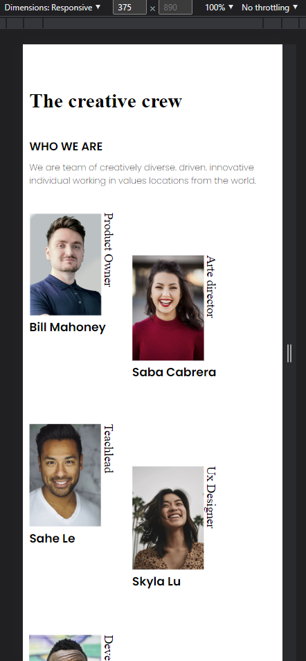
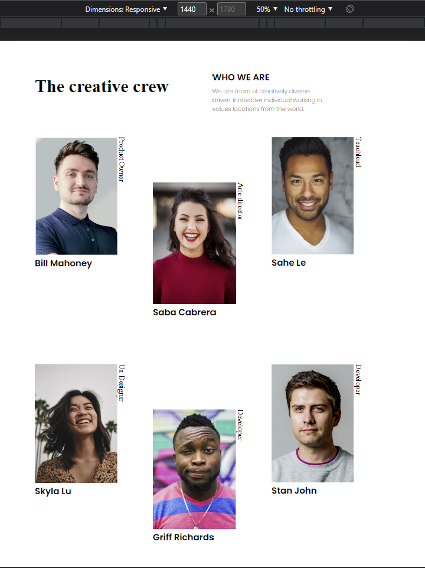

# Make It Real - My team page

This is a solution to the My team page project of the Make It Real course.

## Table of contents

- [Overview](#overview)
  - [The challenge](#the-challenge)
  - [Screenshot](#screenshot)
- [My process](#my-process)
  - [Built with](#built-with)
  - [What I learned](#what-i-learned)
  - [Continued development](#continued-development)
  - [Useful resources](#useful-resources)
- [Author](#author)
- [Acknowledgments](#acknowledgments)


## Overview

### The challenge

Users should be able to:

- Visualize the page in desktop a mobile resolution properly

### Screenshot




## My process

### Built with

- HTML5
- CSS
- CSS Grid
- Mobile-first workflow

### What I learned

In this project we learn how to use CSS Grid to change make a responsive image gallery.

```css
.container {
    display: grid;
    grid-template-columns: 1fr 1fr;
    padding: 60px 120px 10px 120px;
  }

  .imgContainer {
    padding-top: 10px;
    display: grid;
    grid-template-rows: 1fr 1fr 1fr 1fr 1fr 1fr 1fr 1fr 1fr;
    grid-template-columns: 1fr 1fr 1fr;
    padding: 50px 120px 20px 120px;
  }

  .img1 {
    grid-column: 1;
    grid-row: 1/4;
  }

  .img2 {
    grid-column: 2;
    grid-row: 2/5;
  }
}
```


### Continued development

We need to continue learning about how flexbox and Grid works.

### Useful resources

- [Resource 1](https://developer.mozilla.org/en-US/docs/Web/CSS/CSS_Grid_Layout) - This helped me to understand CSS Grid.

## Author

- Juan Sebastián Muñoz


## Acknowledgments

Thanks to Salomón and the teachers.
